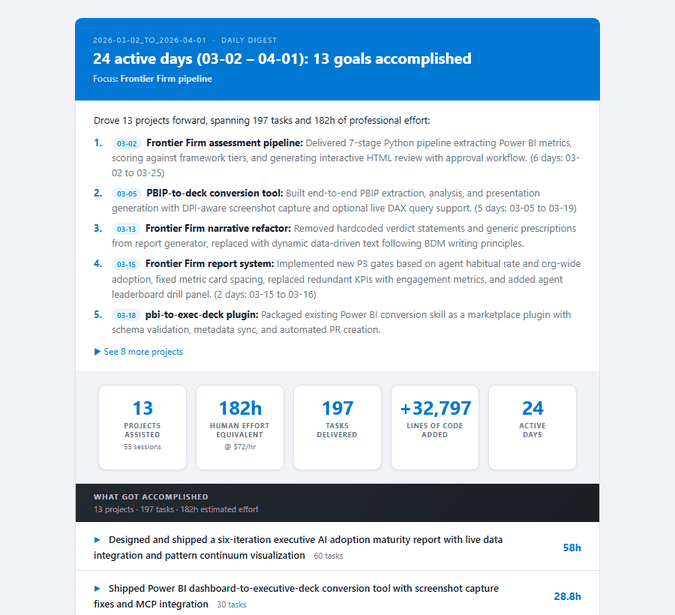

<div align="center">

# 🤖 What I Did — Claude Impact Report

**Turn invisible AI collaboration into a visible story of impact.**

*One command generates a polished report on what you built with Claude, how you worked, the skills it augmented, and the leverage it delivered.*

[](https://python.org)
[](https://claude.ai)
[](LICENSE)

<br>



</div>

---

> **"Where did the tokens go? What am I actually building with Claude? Am I accessing skills I didn't have before?"**

If you can't answer these confidently, you're not alone. Most people know Claude helps — but can't show *how much*, at *what*, or *why it matters*. This tool turns your local Claude Code session logs into a single report that makes the invisible visible — what got built, what skills were augmented, and what it would have cost to do it alone.

## What's in the Report

### ✅ What Got Accomplished

Every project broken down into goals and tasks with effort estimates, skill tags, and document references. Click any row to expand the full task breakdown. This is the evidence trail.

### 📦 What Got Produced

Tangible artifacts — scripts, reports, documents, presentations, config files — categorized and counted. Not "Claude helped me code" but "Claude helped me ship 4 Python modules, 2 HTML reports, and a PowerShell deployment script."

### 🧠 Skills Claude Augmented

*"This is the team Claude assembled for me — on demand, at zero headcount cost."*

Hours of assistance mapped across **20+ professional roles** — Software Engineer, Data Analyst, UX Designer, Solutions Architect, Management Consultant, and more. See exactly which disciplines Claude staffed for you, ranked by time invested.

### 🎯 How You Collaborated

Every interaction classified by intent — Building, Researching, Designing, Investigating, Iterating, Shipping. Discover your collaboration signature: is Claude an always-on crutch or a targeted force multiplier?

### ⏰ When You Collaborated

Time-of-day activity patterns with a daily heatmap — spot whether you're an early-morning builder or a late-night debugger, and whether AI assistance is concentrated or spread across your day.

### 📐 Estimation Evidence

Collapsible detail showing the quantitative signals behind every effort number — tool invocations, active engagement time, token volumes, and the deterministic formula. Evidence that Claude isn't just handling boilerplate — it's tackling real complexity.

## Quick Start

### 1. Clone

```bash
git clone https://github.com/shailendrahegde/What-I-Did-Claude.git ~/claude/whatidid
cd ~/claude/whatidid
```

### 2. API key

No setup needed if you use Claude Code — the tool reads your key directly from `~/.claude/config.json`.

To override (e.g. in CI or without Claude Code):
```bash
export ANTHROPIC_API_KEY=sk-ant-...
```

### 3. Run your first report

```bash
# Last 7 days (default)
python whatidid.py

# Lookback shortcuts — any number of days
python whatidid.py --7D
python whatidid.py --14D
python whatidid.py --30D

# Specific date
python whatidid.py --date 2026-03-30

# Date range (e.g., all of March)
python whatidid.py --from 2026-03-01 --to 2026-03-31

# Send report via Outlook (auto-detects email from git config)
python whatidid.py --email

# Send to a specific address
python whatidid.py --14D --email you@company.com

# Force re-analysis (bypass cache)
python whatidid.py --refresh

# Freeze estimates (lock cache so --refresh won't overwrite)
python whatidid.py --lock
```

### 4. Optional: PowerShell shortcut

Add to your PowerShell profile (`$PROFILE`) to run from anywhere:

```powershell
function whatidid { python "C:/Users/yourname/claude/whatidid/whatidid.py" @args }
```

Then:
```bash
whatidid --14D --email
```

### 5. Optional: Claude Code skill

Copy `skill/SKILL.md` to `~/.claude/skills/whatidid/SKILL.md` so you can trigger the digest from within any Claude session by typing `/whatidid`.

## How It Works

```
~/.claude/projects/*/session.jsonl
              │
              ▼
         harvest.py    → scan sessions, extract messages, tool calls,
              │           intent classification, active engagement time
              ▼
         analyze.py    → semantic analysis via Claude API (Haiku)
              │           calibrated effort estimation, professional roles,
              │           caches results per day
              ▼
         report.py     → HTML report: dark-header sections, donut charts,
              │           heatmaps, skills bars, estimation evidence
              ▼
       whatidid.py     → opens in browser; --email sends via Outlook COM
```

See [docs/architecture.md](docs/architecture.md) for session file format details, token cost model, and estimation methodology.

## Requirements

| Requirement | Why |
|---|---|
| **Python 3.10+** | Core runtime — standard library only, no `pip install` needed |
| **Claude Code** | Session data source — sessions stored at `~/.claude/projects/` |
| **Anthropic API key** | For semantic analysis — auto-read from `~/.claude/config.json` |
| **Windows + Outlook** | *(Optional)* For `--email` delivery via PowerShell COM automation |

## Configuration

All tuneable constants are at the top of their respective files:

| File | Constant | Default | Description |
|---|---|---|---|
| `whatidid.py` | `DEFAULT_EMAIL` | `shahegde@microsoft.com` | Recipient for `--email` (overridden by git config) |
| `report.py` | `HOURLY_RATE` | `72` | $/hr used to compute human effort value |
| `report.py` | `SEAT_COST_PER_MONTH` | `19` | Claude Pro subscription $/month |
| `analyze.py` | `MODEL` | `claude-haiku-4-5` | Model used for semantic analysis |

## Date Formats

All date arguments accept multiple formats:

```bash
python whatidid.py --date 2026-03-30        # YYYY-MM-DD
python whatidid.py --date 30-Mar-2026       # DD-Mon-YYYY
python whatidid.py --date 03/30/2026        # MM/DD/YYYY
python whatidid.py --date 7D                # last N days
python whatidid.py --7D                     # shorthand flag
python whatidid.py --from 2026-03-01 --to 2026-03-31
```

## Caching

Analysis results are cached in `cache/YYYY-MM-DD.json`. Re-running for the same date uses the cache (token counts are always refreshed from live data).

- `--refresh` — force a new analysis, overwriting the cache
- `--lock` — freeze estimates; future `--refresh` calls are ignored until you delete the cache file

## Troubleshooting

**No sessions found** — Claude Code stores sessions in `~/.claude/projects/*/session.jsonl`. Make sure you've used Claude Code on the target date.

**Heuristic analysis instead of semantic** — the API key isn't being found. Check that `~/.claude/config.json` exists and contains a `primaryApiKey` field, or set `ANTHROPIC_API_KEY` in your environment.

**Email not sending** — requires Windows with Outlook installed and signed in. The PowerShell COM automation uses your active Outlook profile.

**Unicode errors on Windows** — run with `PYTHONUTF8=1 python whatidid.py`.

**Estimation Evidence section is empty** — old cache files don't have `session_metrics`. Run `--refresh` to regenerate with the full evidence data.

## Files

```
whatidid.py        Entry point — CLI flags, date parsing, orchestration
harvest.py         Reads ~/.claude/projects/*/session.jsonl; intent classification
analyze.py         Claude API semantic analysis; caches per-day results
report.py          HTML report generation — all section rendering
email_send.py      Sends via PowerShell Outlook COM (Windows)
skill/SKILL.md     Claude Code skill registration (/whatidid)
docs/
  rules.md         Analysis rules — goal grouping, language, effort estimation
  architecture.md  Data flow, session file format, token cost model
cache/             Per-day analysis cache (YYYY-MM-DD.json)
```

## License

MIT
